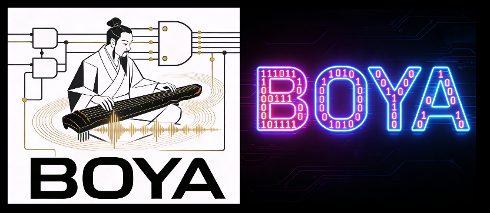
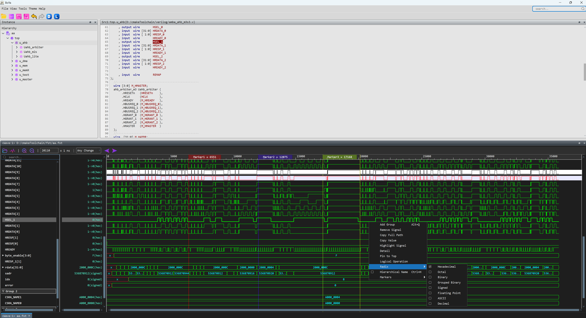

<p align="center" style="display: flex; align-items: center; justify-content: center;">
  
</p>


[中文](README.md) | English

BoYa​ is a feature-rich, advanced open-source waveform viewer and analysis tool, specifically designed for digital logic designers and verification engineers. It supports multiple file formats and provides seamless debugging and tracing capabilities by correlating waveforms with RTL source code. BoYa offers detailed and comprehensive waveform annotation and viewing features, an elegant and clean interface for both code and waveforms, and is cross-platform and portable. Pre-built binary packages are available for both Windows and Linux, ready to use out-of-the-box. We are committed to continuously enriching, refining, expanding, and evolving this tool to make free waveform debugging painless.

<p align="center" style="display: flex; align-items: center; justify-content: center;">
  
</p>

## Key Capabilities
- Supports VCD and FST waveform formats
- Supports correlation between waveforms and SystemVerilog, Verilog, and Chisel source code projects
- Supports mapping between SystemVerilog/Verilog and Chisel (Scala) code
- Double-click signals in the waveform to navigate to corresponding RTL code
- Trace signal driver sources and loads
- Global signal search, search within waveform values and their expressions
- Supports Windows and Linux platforms


## Features
### File & Data Loading
- Supports multiple waveform formats: VCD, FST (Other formats like FSDB can be converted using third-party tools like fsdb2vcd)
- Load multiple RTL source files (.v, .sv) and filelists
- Save and load workspace history (including signal list, groups, etc.)
### Signal Management & Operations
- Add signals to the waveform view individually or in batches
- Add signals to the waveform from the source code panel via right-click, keyboard shortcuts, or drag-and-drop for single or multiple selections
- Add, remove, and rename signal groups
- Move signals within or between groups; move entire groups
- Remove signals from the waveform view
- Signal highlighting and background highlighting
- Copy a signal's full hierarchical path or current value
- "Pin" important signals to the top of the list
- Expand/collapse multi-bit signals for detailed viewing
- Switch value display formats (Binary, Octal, Decimal, Hexadecimal, etc.)
- Support for various logical expression operations
- Signal bit concatenation
### Waveform Viewing & Analysis
- Zoom in/out in the waveform view
- Support for displaying multiple waveform regions
- Jump to a specific timestamp
- Set and navigate between marks
- Edge/transition detection: Jump based on any edge, rising edge, falling edge, specific value, or signal change
- Count rising/falling edges of selected signals within a specified time range
- Signal search within waveforms
### Source Code Integration & Debugging
- Interactive highlighting of operable signals in RTL source files
- Mapping support between Verilog/SystemVerilog and Chisel (Scala) code
- Trace signal driver sources and loads
- Double-click a signal to jump to its driver source
- Drag a signal to jump to its load
- Double-click a signal in the source code to jump to its driver
- Navigate to module instantiation and definition sites
- Hover over signals in source code to display their value at the current simulation time
- Global search
- Text search within source files
- Jump to a specific line number in the source code
- Navigate forward/backward through waveform search history
### Global Settings
- Switch between three theme modes
- Global font settings
- Configure global keyboard shortcuts
- Quick layout restoration

## Quick Start
- Pre-built binary executables are available for direct download. Get started immediately with a ready-to-run experience.

### Windows Download
- https://github.com/OS-CHIP/BoYa/releases/download/V1.0.2/BoYa.zip
### Linux Download
- https://github.com/OS-CHIP/BoYa/releases/download/V1.0.2/BoYa-x86_64.AppImage

### Example Quick Start
1. **Launch the BoYa Tool**
- Windows:​ Run BoYa.exe
- Linux:​ Run BoYa-x86_64.AppImage

2. **Load Design Files**
- Go to `File` → `Import Design`
- Navigate to and select all .v files under example/rtl/

3. **Open Waveform Files**
- Go to `File` → `Open File`
- Choose either example/sim/wave.fst or example/sim/wave.vcd

4. **View and Debug Waveforms**
- Drag signals from the source code window, or click `Get Signals` to select signals and add them to the waveform view
- Use the waveform tools to inspect signals or perform debugging

5. **Additional Documentation**
- For detailed tutorials, advanced features, and troubleshooting, visit our Wiki: https://github.com/OS-CHIP/BoYa/wiki

## Build from Source
- If you prefer to compile BoYa from source, please follow the instructions below.
  
### Prerequisites
- **Qt:** Version 6.x or higher (6.5+ recommended)
- **CMake:** Version 3.16 or higher
- **C++ Compiler:** Supporting C++17 (e.g., MSVC 2019/2022 on Windows, GCC on Linux)

### Build Instructions
``` bash
git clone https://github.com/OS-CHIP/BoYa.git
cd BoYa
```
##### Building with Qt Creator (Recommended for Development)
1.  Open Qt Creator.
2.  Select  `File` → `Open File or Project...` and navigate to the `bo-ya/CMakeLists.txt` file.
3.  Qt Creator will prompt you to configure the project. Use the default settings (select a kit).
4.  Click the `Build` (hammer) icon or press `Ctrl+B` to build the project.
5.  Click the `Run` (green arrow) icon or press `Ctrl+R` to launch BoYa.

## Usage
Command Line Options
``` bash
BoYa [options] [source-files...]

Options:
  -h, --help                    Print usage information
  -f, --filelist <path>         Filelist input file path (can be specified multiple times)
  -w, --waveform <path>         Waveform input file path
  --source-files <files>        Direct source files (.v, .sv extensions)
```


## Feedback & Contribution
We welcome all forms of feedback and contributions! Please feel free to submit issues and pull requests on our [GitHub repository](https://github.com/OS-CHIP/BoYa). 

Or you can contact us via: OSCHIP@126.com for feedback and cooperation. 

Your input is highly valued and is a key driver for our continuous improvement.

